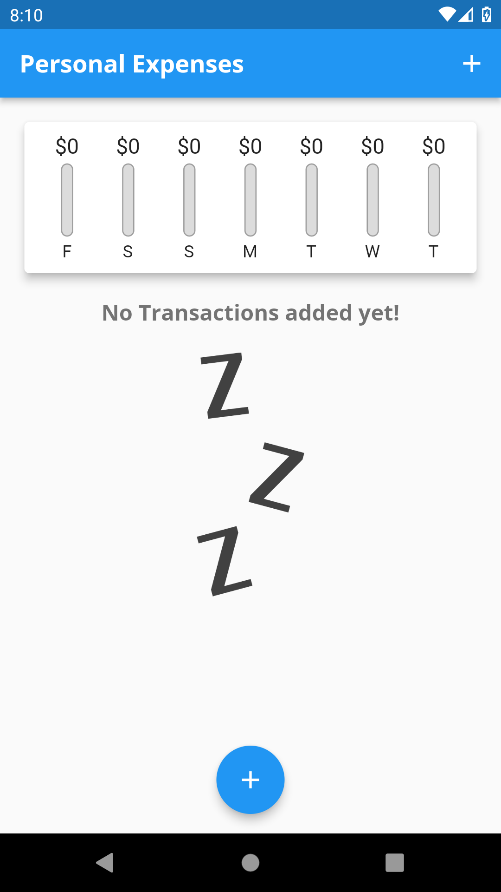
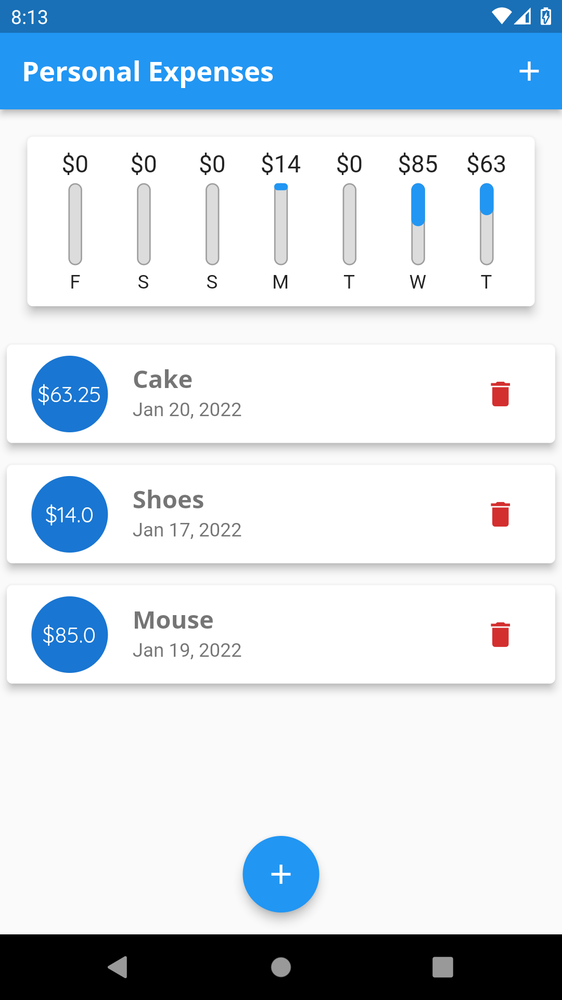

# Personal expenses app

This is an App which can be used to track one's personal expenses

### TODO:

- [ ] Connect to a database to save the transactions
- [ ] Add dark and light themes
- [ ] Add a switch button to switch between themes
- [ ] Add a splash screen in the app

# Screenshots

